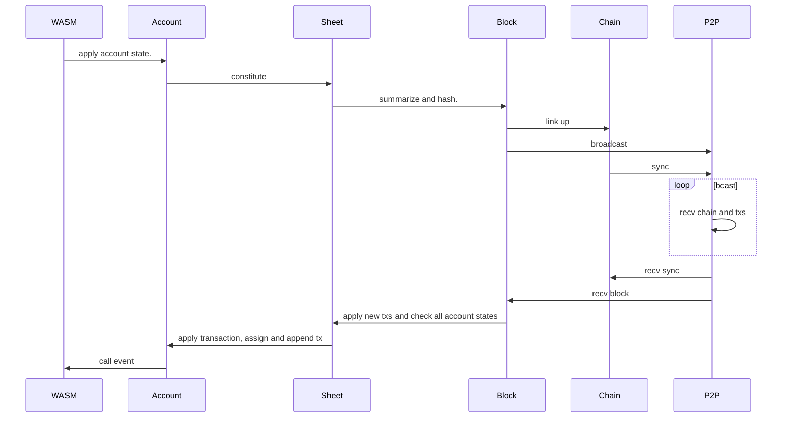

title: NGIN - 基於區塊鏈的分佈式應用引擎生態系統
speaker: NGO
url: https://github.com/ngchain
prismTheme: tomorrow
plugins:
    - echarts
    - mermaid
    - katex

<slide class="bg-white aligncenter">

# 

# 基於區塊鏈的分佈式應用引擎生態系統 {.text-landing.text-shadow}

---

**NGIN** is pronounced "engine" {.text-intro}

[:fa-github: GH源碼](https://github.com/ngchain){.button.ghost} 
[:fa-git: 内部源碼](https://code.ngin.cash){.button.ghost}
[:fa-server: 節點](https://github.com/ngchain/ngcore){.button.ghost}
[:fa-money: 錢包](https://github.com/ngchain/hawkhover){.button.ghost}

<slide class="bg-white aligncenter">

:::div {.content-left}

## 特性 {.text-landing.text-shadow}

---

- 純内存模式極速啓動

- 存儲集約且客戶端區塊數據可刪除，保證安全與靈活

- 人性化賬戶設計， 用戶可使用便於記憶的純數字賬戶發送事務

- Vault化的Block設計，保證全網絡下賬戶安全

- 支持多種强大且可拓展事務類型

- 支持同時對多個對象的事務（Multi-Tx）

- WASM通用智能合約，支持C，C++，rust等多種熱門編程語言

- 易於更新維護的智能合約設計

- 基於libp2p（ipfs）的點對點網絡

- 支持使用匿名地址（非數字賬號）接受交易

- Schnorr簽名算法，支持聯合簽名（Multi-Sig）

- 基於Fee的主網幣銷毀策略，維持主鏈上供需平衡保證價值

- Swagger restful接口
:::

:::div {.content-right}

:::card {.quote}

> "**NGIN** is the best public PoW chain yet.”
> ==Leonardo da Vinci==
:::
:::

<slide class="bg-white aligncenter">

## 架構 {.text-landing.text-shadow}

---

<slide class="bg-white aligncenter">

:::div {.content-left}

## ngCore

---

ngCore是NGIN網絡上第三版golang運行時實現。

另外ngBiz是ngCore在聯盟鏈上的嘗試，使用PBFT代替ngCore的PoW共識。
:::

:::div {.content-right}
前兩版分別為ngind（基於go-ethereum）與ngd/ngdaemon（未開源）。
最初始NGIN項目目標為建立基於區塊鏈的*搜索引擎*生態。
ngind由於原俄羅斯團隊無閑暇而放棄維護。
ngd/ngdaemon由於新團隊人員變動以及行業發展帶來的項目目標變動而遭到淘汰。
其中部分代碼在初始階段的ngCore有所保留，現在已經全部被替換。

從代碼層面，ngCore非任何其他項目的fork。ngCore目前實現了所有區塊鏈公鏈基本功能包括P2P網絡與圖靈完備的WASM虛擬機。

ngCore目前接口協議尚未穩定，正在完成從jsonrpc-v2到swagger-restful的遷移。

:::
:::

<slide class="bg-white aligncenter">

:::div {.content-left}

:::

:::div {.content-right}

### Hawkhover

---

Hawkhover是針對NGIN類型的多平臺數字錢包應用，基於dart與flutter，可直接安裝于Windows&Linux desktop，Android以及iOS。

目前UI已經頁面邏輯已經完成，由於ngCore接口未穩定因此仍需適配
:::

<slide class="bg-white aligncenter">

:::div {.content-right}

:::

<slide class="bg-white aligncenter">

## 與比特幣的區別

--- 

- NGIN的目標和BTC不同，并非創建任何數字貨幣或者支付手段。NGIN的目標是建立基於區塊鏈的可信應用生態
- NGIN使用數字賬戶，更便捷
- NGIN使用Schnorr簽名，Bitcoin使用ECDSA: [Schnorr vs ECDSA](https://bitcoin.stackexchange.com/questions/77234/schnorr-vs-ecdsa)
- NGIN使用Fee的銷毀保證主網幣NG的價值，并不會像BTC一樣減產
- ... 

<slide class="bg-white aligncenter">

## 與以太坊的區別

---

- NGIN的目標和ETH不同，并非創建任何代幣生態。NGIN的目標是建立基於區塊鏈的可信應用生態
- NGIN更建議部署非代幣相關的分佈式應用 - 例如爬蟲，存儲，網站等
- NGIN使用數字賬戶，更便捷
- NGIN使用Schnorr簽名，Ethereum使用ECDSA: [Schnorr vs ECDSA](https://bitcoin.stackexchange.com/questions/77234/schnorr-vs-ecdsa)
- 不同於EVM，NGIN内嵌更加通用的WASM虛擬機，可以使用asm.js, rust, kotlin, c, c++等高級語言進行編程
- ...
