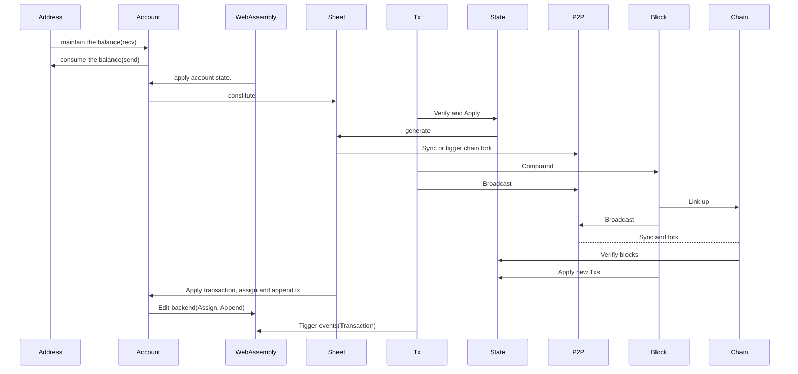
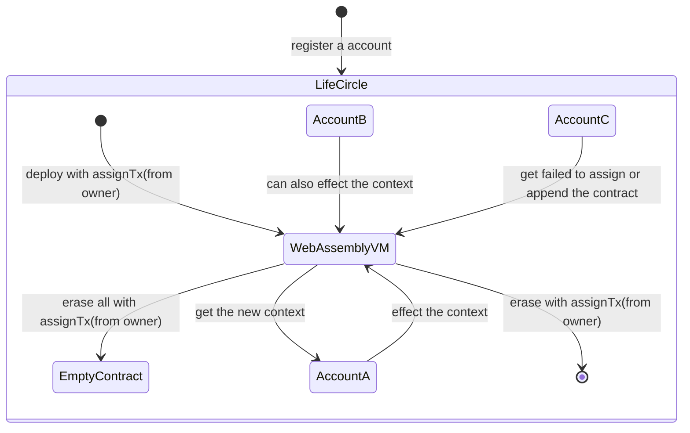
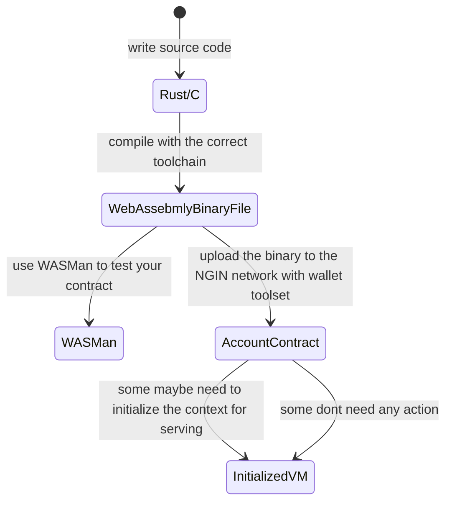

title: NGIN - Decentrailized Application Engine based on Blockchain Ecosystem
speaker: NGO
url: https://github.com/ngchain
prismTheme: tomorrow
plugins:
    - echarts
    - mermaid
    - katex

<slide class="bg-white aligncenter">

# 

# Decentrailized Application **Engine**  {.text-shadow}
# based on Blockchain Ecosystem {.text-shadow}

---

**NGIN** is pronounced "engine" {.text-intro}

[:fa-github: Github](https://github.com/ngchain){.button.ghost} 
[:fa-git: Gitea](https://code.ngin.cash){.button.ghost}
[:fa-server: Deamon](https://github.com/ngchain/ngcore){.button.ghost}
[:fa-money: Wallet](https://github.com/ngchain/hawkhover){.button.ghost}

<slide class="bg-white aligncenter">

:::div {.content-left}

# Features {.text.text-shadow}

---

:::card 
- **Thoroughly new chain**, modern design from scratch with high tps
- Written in go, **not a fork** of any other chain
- Optional less, or **no storage cost**(mem only)
- With **humanizing** numeric account model, users can send tx with **memorable short number**
- **High security** with Sheet and Vault(Block) model
- Powerful and scalable types of tx
- Support **Multi-Tx**, sending coins to different recipants in the same time
- Powerful **WebAssembly** VM support based on account's contract
- Contract is **more maintainable** than ethereum
- **Libp2p(ipfs)** powered p2p networking
- Support NAT & UPnP, no public IP requirement
- Available **anonymous** address for saving balance
- Using the **schnorr signature**, allowing **Multi-Sig** when sending and receiving
- **Fee Burnt Policy** keeps the mainnet coin NG's value
- Using **JSON RPC v2 API**, be friendly to the developers

:::

- Auto switch to the best one when chain branching
- Addresses are for **receiving** coins only
- Require register an account on chain for **sending**
- Support **zero fee** transaction
- ...

> "**NGIN** is the best public PoW chain yet.”
> ==Leonardo da Vinci==

<slide class="bg-white aligncenter">

# Structure {.text-shadow}

---

<slide class="aligncenter">

:::div {.content-left}

# [ngcore](https://github.com/ngchain/ngcore)

License\: {.text-subtitle}
- GPLv3 for all pre-release version (under v0.1.0)
- MIT for all version after release
---

"ngcore" is the third-version full-node daemon on NGIN

Concurrently, the "ngbiz" is a new try for union chain based on ngcore's codebase, within which we use PBFT replacing PoW consensus.

:::

:::div {.content-right}
The first two versions are "ngind"(based on go-ethereum) and "ngd"(aka ngdaemon, published on internal git repo not github)
Initially, NGIN project was aiming to build **an internet serach engine**(like google) ecosystem based on blockchain
But ngind was soon deprecated due to the origin Russian team's plan.
And then ngd/ngdaemon's team continued their project but then it was also deprecated before releasing because of the team broke up.
Some codes of ngd/ngdaemon are inherited by ngcore when ngcore starts, but now all be placed by new codes.

From the view of codebase, ngcore is **not a fork of any project**. Currently, ngcore has implemented all core functions of a blockchain public chain, like p2p network protocol, memory-safe VM based on WebAssembly, etc.

Now, ngcore is on alpha period.

:::
:::

<slide :class="size-50">

## [WASMan](https://github.com/C0MM4ND/wasman)

License\: MIT

---

WASMan(WebAssembly Manager) is another wasm interpreter engine for gophers and blockchain.

Currently, WASMan has been assembled into the ngcore's ngstate module, acting as the contract backend, 
which means ngcore has already be able to run webassembly contracts on blockchain.

:::div {.content-left}

Features
- All-in-One W3C standard webassembly interpreter
- Support the toll(gas) station design, which is necessary under blockchain environment
- Provide cli tool for testing

:::

:::div {.text-pull-right}

Some webassembly examples on rust!

- hostbytes [source](https://github.com/C0MM4ND/minimum-wasm-rs/tree/master/hostbytes) 
&rarr; [runtime](https://github.com/C0MM4ND/wasman/tree/master/examples/hostbytes){.text-intro}

- hoststring [source](https://github.com/C0MM4ND/minimum-wasm-rs/tree/master/hoststring) 
&rarr; [runtime](https://github.com/C0MM4ND/wasman/tree/master/examples/hoststring)

- log [source](https://github.com/C0MM4ND/minimum-wasm-rs/tree/master/log)
&rarr; [runtime](https://github.com/C0MM4ND/wasman/tree/master/examples/log)

- numeric [source](https://github.com/C0MM4ND/minimum-wasm-rs/tree/master/numeric)

<slide class="bg-white aligncenter">

:::div {.content-left}

:::

:::div {.content-right}

### Hawkhover

---

Hawkhover a multi-platform GUI wallet for NGIN daemon, which is designed by dart and flutter and can be installed on Windows/Linux desktop, Android and iOS.

Hawkhover will be released after ngcore's beta period
:::

<slide class="bg-white aligncenter">

:::div {.content-right}

:::

<slide class="bg-white aligncenter">

## Diff between **BTC** & NGIN

--- 

- Goal of NGIN, not creating any crypto currency or building a new payment method, is maintaining a decentrialized application engine with reliable blockchain ecosystem
- Using number account, not garbled string. So more convenient.
- Using Schnorr signature，not ECDSA\: [Schnorr vs ECDSA](https://bitcoin.stackexchange.com/questions/77234/schnorr-vs-ecdsa)
- No half-life period, NGIN using Fee Destory Policy to keep the value of mainnet coin.
- ... 

<slide class="bg-white aligncenter">

## Diff between **ETH** & NGIN

---

- Goal of NGIN, not creating token ecosystem, is maintaining a decentrialized application engine with reliable blockchain ecosystem
- NGIN suggests non-financial decentralized applications like spiders, storages and webservices etc.
- Using number account, not garbled string. So more convenient.
- Using Schnorr signature，not ECDSA: [Schnorr vs ECDSA](https://bitcoin.stackexchange.com/questions/77234/schnorr-vs-ecdsa)
- No EVM，and NGIN assembles more common WebAssembly VM, with which developers can create their app with asm.js, rust, kotlin, c, c++ etc.
- ...

<slide class="bg-white aligncenter">

## Life circle of a WASM contract

---

<slide class="bg-white aligncenter">

## Steps to build and deploy a WASM contract

---

